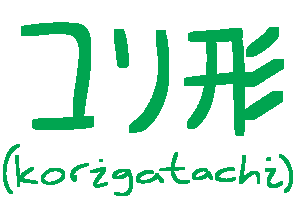

# Korigatachi - 6502 assembler as embedded Haskell.

Korigatachi is a silly little library that lets you write 8-bit assembly programs
directly inside of Haskell. Using the "powerful" `Korigatachi` monad, you can write
the `Assembly ()` you know and love and then `render` it to `Text` to be assembled later.
Better yet, You can even `assemble` it from inside the monad itself, and get a valid binary
you can play on your own Atari! Snazzy, ain't it?

## Feature Overview

* It works.
* Utility functions for the Atari 2600 and no other machine.
* Supports undocumented opcodes so you can generate programs that crash.
